

  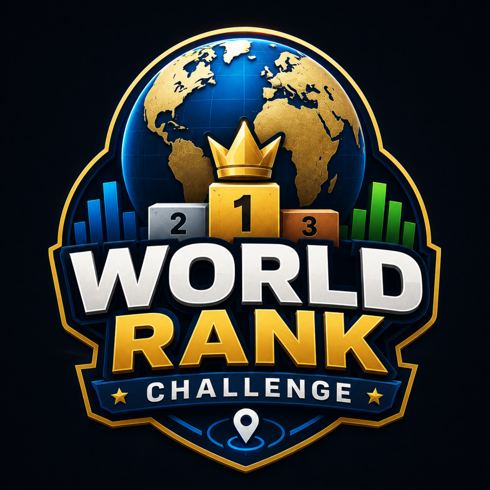

  # World Rank Challenge — App Showcase

  **A geography strategy game for iPhone where country knowledge, ranking intuition, and careful category choices determine your score.**

  [View on the App Store](https://apps.apple.com/tr/app/world-rank-challenge/id6798357229)

> This public repository is a product and engineering showcase. The production source code remains private and proprietary.

## Overview

World Rank Challenge turns real-world country rankings into a strategic eight-round game. A country is drawn each round and must be placed into one unused category. The country's real ranking becomes the score for that slot, and the lowest final total wins.

Players can compete with all 193 UN member countries in World Mode or focus on 45 European countries in Europe Mode.

## App Store Screenshots — English

  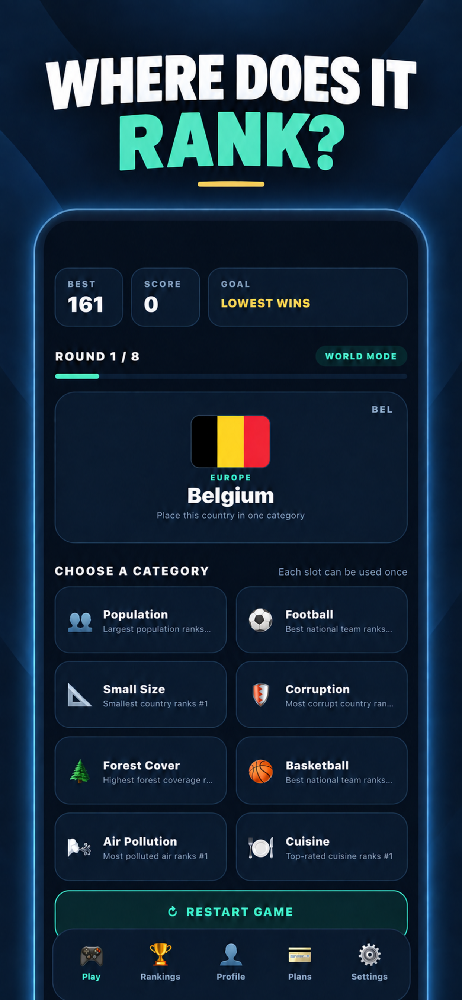
  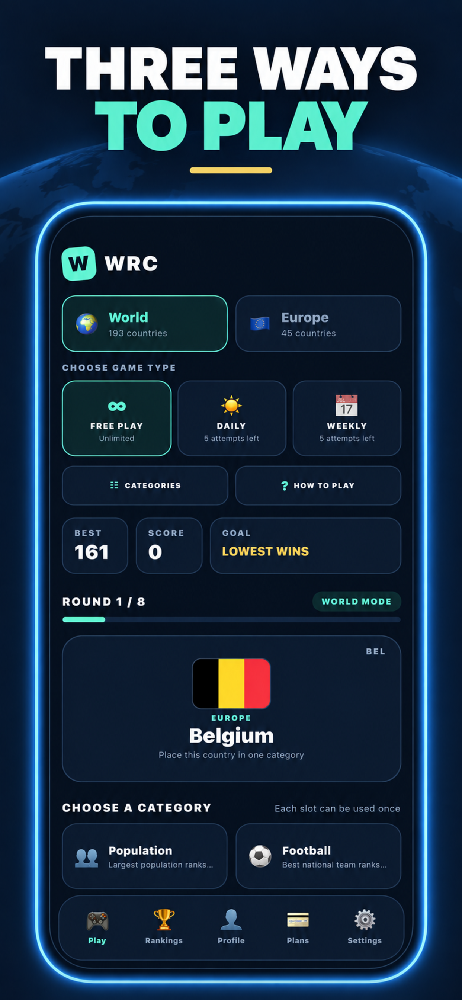
  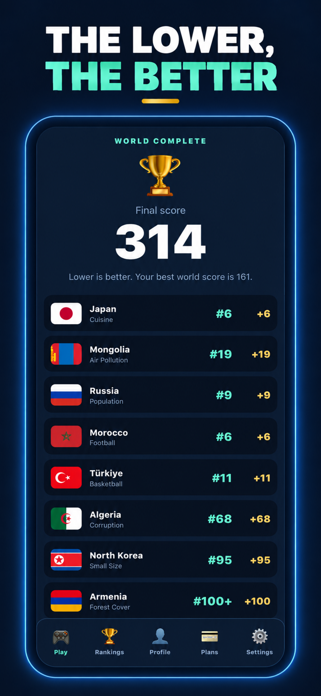

  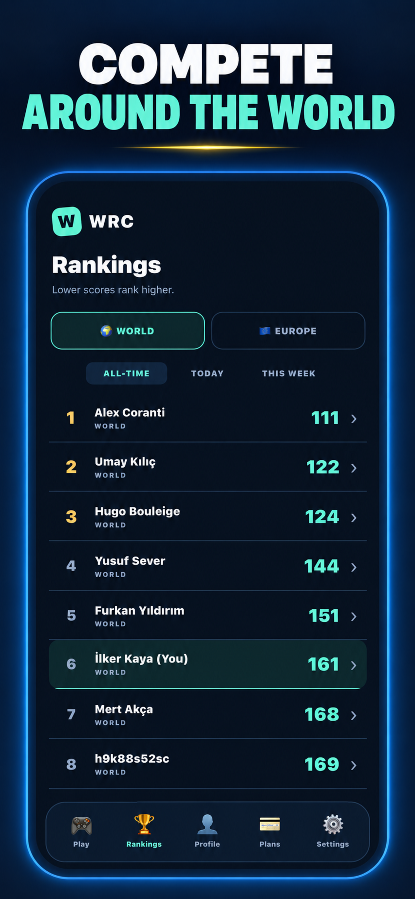
  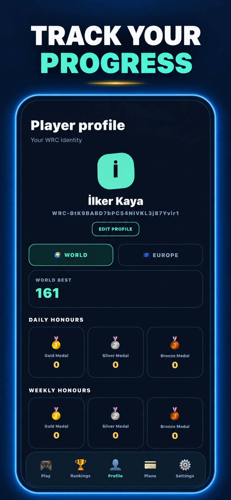

## App Store Screenshots — Türkçe

  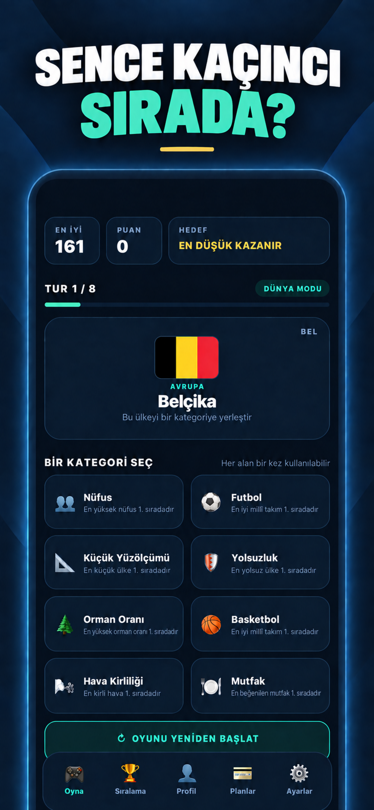
  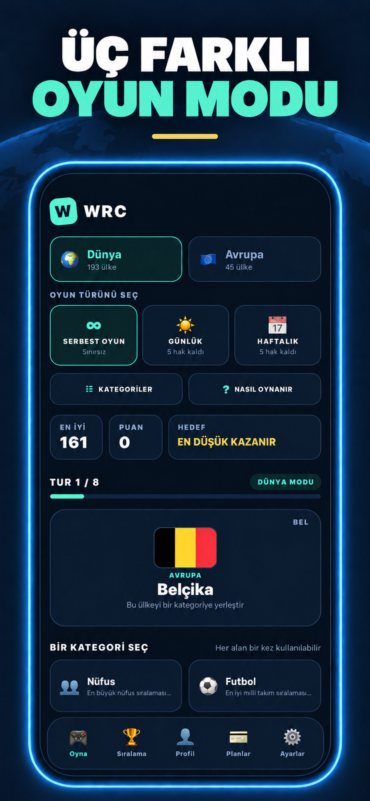
  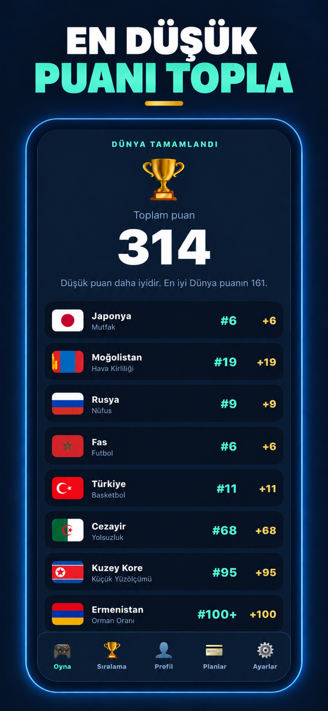

  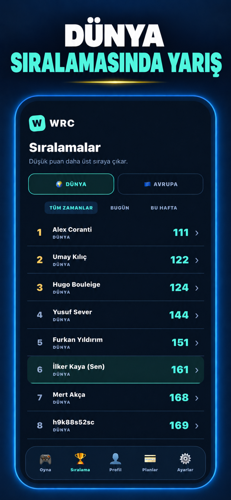
  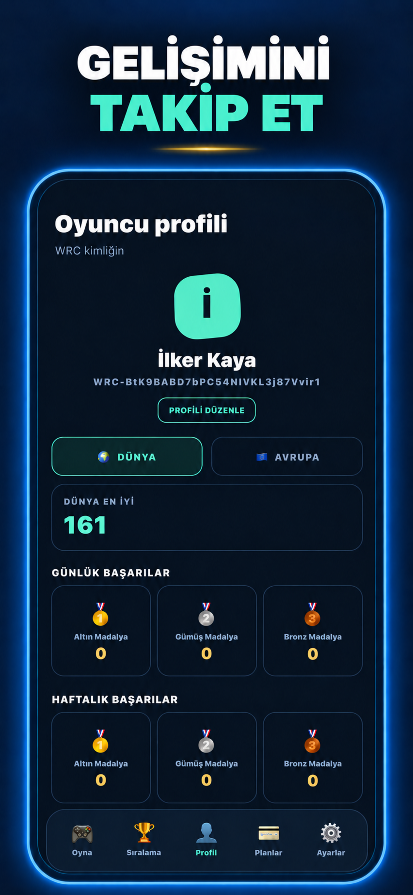

## Product Highlights

- World Mode with 193 UN member countries
- Europe Mode with 45 European countries
- Free Play, Daily Challenge, and Weekly Challenge modes
- Eight ranking categories per game with one-time slot usage
- Global World and Europe leaderboards
- Player profiles, best scores, statistics, and medal history
- Separate World and Europe challenge attempts and achievements
- Guest play plus Google and Apple authentication
- English and Turkish localization
- Premium subscription and purchase restoration
- Consent-aware advertising and configurable game audio

## How It Works

1. Choose World or Europe and select Free, Daily, or Weekly play.
2. Receive a randomly drawn country in each of eight rounds.
3. Place the country into one remaining ranking category.
4. Earn points equal to the country's real position in that category.
5. Finish all eight rounds with the lowest total score possible.
6. Compare results on leaderboards and track medals in the player profile.

## Engineering Overview

The app combines a local ranking-based game engine with cloud-backed identity, profiles, competitive challenges, and scheduled medal awards.

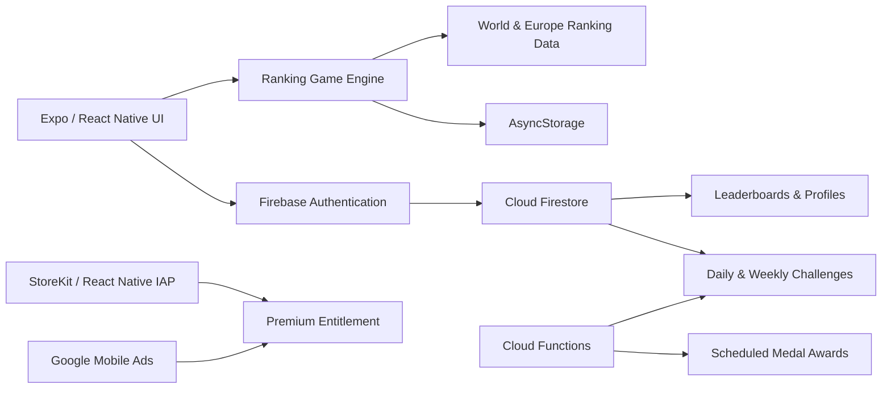

### Selected Engineering Challenges

- Modeling rankings whose scoring direction differs by category
- Supporting separate World and Europe datasets and statistics
- Preserving legacy player data while introducing mode-specific profiles
- Enforcing challenge attempts and score integrity with Firestore rules
- Awarding Daily and Weekly medals through scheduled Cloud Functions
- Supporting guest, Google, and Apple authentication flows
- Localizing the full experience in English and Turkish
- Coordinating subscriptions, purchase restoration, ads, and consent flows
- Preparing native iOS builds and App Store releases with Expo EAS

## Technology Stack

- TypeScript
- React Native
- Expo
- Firebase Authentication
- Cloud Firestore
- Firebase Cloud Functions
- Async Storage
- React Native IAP / StoreKit
- Google Mobile Ads
- Expo EAS Build

## Availability

World Rank Challenge is available on the Turkish App Store:

**[Download World Rank Challenge on the App Store](https://apps.apple.com/tr/app/world-rank-challenge/id6798357229)**

The app interface supports both English and Turkish.

## Developer

Built by [Harun İlker Kaya](https://github.com/HarunIlkerKaya), a Software Engineering student focused on mobile, frontend, and cloud-connected product development.

## Source Code and Rights

The production source code is maintained in a private repository. This showcase contains promotional images and high-level technical documentation only. It does not grant permission to reproduce the application, branding, datasets, or visual assets.

See [NOTICE.md](NOTICE.md) for details.
